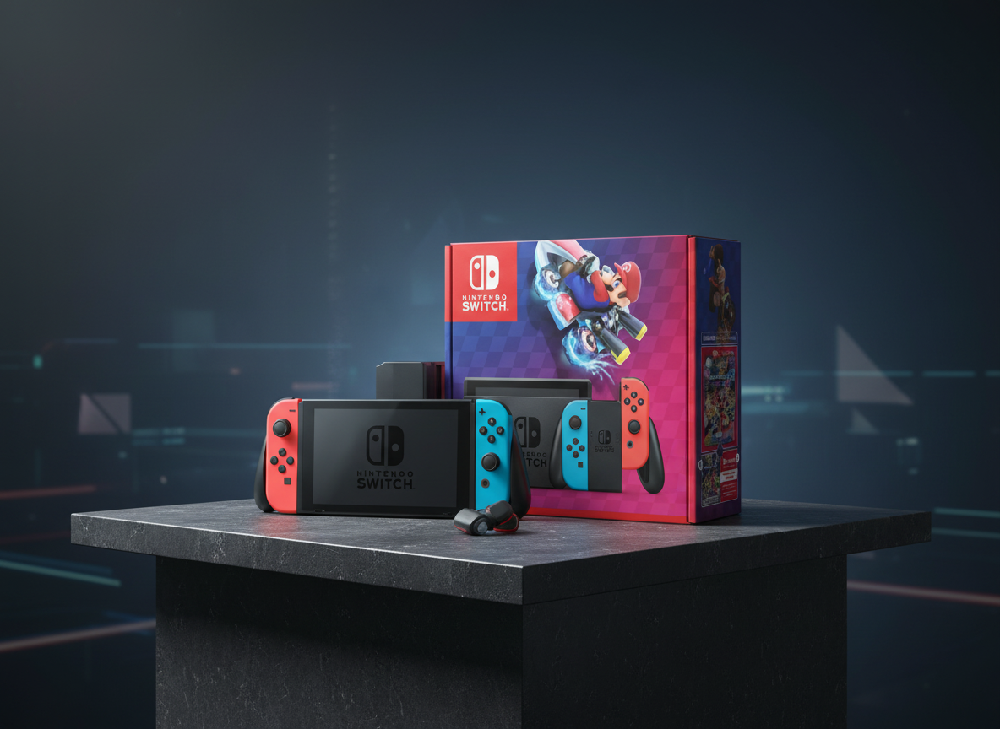

# 🎨 Bodegón Creator - Automated Web Scraping & Artistic Composition

> Transform product images into artistic bodegón compositions using AI-powered web automation and image generation.

[](https://claude.ai)
[](https://playwright.dev)
[](https://nanobanana.ai)

## 📖 Overview

Bodegón Creator is an innovative project that combines web automation with AI-powered image generation to create stunning artistic compositions (bodegón) from product images. Using Claude Code's MCP servers, it automatically scrapes product images from e-commerce websites and transforms them into contemporary still-life art pieces.

## 🚀 Features

- **🌐 Automated Web Scraping**: Navigate and capture product images from any e-commerce website
- **📸 High-Quality Screenshots**: Capture multiple product views with precision
- **🎨 AI-Powered Composition**: Create artistic bodegón using Google Gemini models
- **⚡ One-Command Workflow**: Execute entire process with a single slash command
- **📋 Progress Tracking**: Real-time task monitoring with todo management
- **🔄 Batch Processing**: Process multiple products systematically

## 🏗️ Architecture

```
bodegon/
├── .claude/
│   └── commands/
│       └── bodegon.md           # Custom slash command
├── .playwright-mcp/             # Captured product images
│   ├── product-image-1.png
│   ├── product-image-2.png
│   └── product-image-3.png
├── nanobanana-output/           # Generated bodegón compositions
│   └── remixcrea_un_bodegn_de_imgenes_u.png
├── README.md                    # This file
├── prompt-best-practices.md     # Claude 4.5 prompting guide
├── slash-commands.md            # Slash commands documentation
└── test-1.spec.ts              # Original Playwright test
```

## 🛠️ Prerequisites

### Required MCP Servers

1. **Playwright MCP Server** - For web automation and screenshot capture
2. **NanoBanana MCP Server** - For AI-powered image generation and remixing
3. **Serena MCP Server** - For advanced code manipulation (optional)

### Claude Code Setup

Ensure you have:
- Claude Code installed and configured
- MCP servers properly connected and authenticated
- Appropriate permissions for web automation

## 📦 Installation

1. **Clone or create the project structure:**
```bash
mkdir bodegon-project
cd bodegon-project
```

2. **Create the slash command directory:**
```bash
mkdir -p .claude/commands
```

3. **Copy the bodegon command:**
```bash
# Copy the bodegon.md file to .claude/commands/
```

4. **Verify MCP connections:**
```bash
/mcp
```

## 🎯 Usage

### Basic Command Syntax

```bash
/bodegon [url] [artistic_prompt]
```

### Parameters

- **url**: The e-commerce website URL to scrape product images from
- **artistic_prompt**: Description of how you want the bodegón composition to look

### Example Usage

```bash
/bodegon "https://www.exito.com/tecnologia/consolas-y-videojuegos" "Crea un bodegón elegante que muestre estos productos tecnológicos como piezas de arte contemporáneo con iluminación dramática y composición equilibrada"
```

### More Examples

**Gaming Products:**
```bash
/bodegon "https://store.steampowered.com" "Create a gaming bodegón with dramatic lighting and cyberpunk aesthetic"
```

**Fashion Items:**
```bash
/bodegon "https://www.zara.com" "Transform these fashion items into a sophisticated still-life composition with minimalist style"
```

**Home Decor:**
```bash
/bodegon "https://www.ikea.com" "Create a cozy home decor bodegón with warm lighting and natural elements"
```

## 🔧 Workflow Process

The automated workflow follows these steps:

### 1. **Navigation & Discovery**
- Navigate to the specified URL
- Identify product links and image galleries
- Analyze page structure for optimal capture points

### 2. **Image Capture**
- Click on first product link
- Navigate through product image gallery (typically 3-5 images)
- Capture high-quality screenshots of each product view
- Save images with systematic naming convention

### 3. **Artistic Composition**
- Feed captured images to NanoBanana AI
- Apply the artistic prompt for composition style
- Generate a cohesive bodegón still-life artwork
- Save final composition to output directory

### 4. **Progress Tracking**
- Monitor each step with TodoWrite integration
- Provide real-time feedback on completion status
- Handle errors gracefully with recovery options

## 📊 Output Results

### Generated Files

**Product Screenshots** (`.playwright-mcp/`):
- `product-image-1.png` - Primary product view
- `product-image-2.png` - Alternative angle/view
- `product-image-3.png` - Detail or lifestyle shot

**Artistic Composition** (`nanobanana-output/`):
- `remix[timestamp].png` - Final bodegón artwork

### Example Results


*Captured product images from Nintendo Switch listing*


*Generated artistic bodegón composition*

## 🎨 Customization

### Modifying the Slash Command

Edit `.claude/commands/bodegon.md` to customize:

- **Number of images captured**: Adjust the image capture loop
- **Screenshot regions**: Modify the element selectors
- **Artistic styles**: Update default prompts and parameters
- **Output formats**: Change file naming conventions

### Advanced Configuration

```markdown
# .claude/commands/bodegon.md
---
allowed-tools: TodoWrite, mcp__playwright__browser_navigate, mcp__playwright__browser_click, mcp__playwright__browser_take_screenshot, mcp__plugin_claude-nanobanana_nanobanana__remix_image
argument-hint: [url] [remix_prompt] [style]
description: Custom web scraping and artistic workflow
---
```

## 🔍 Troubleshooting

### Common Issues

1. **MCP Server Connection**
   ```bash
   /mcp  # Check server status
   # Re-authenticate if needed
   ```

2. **Permission Errors**
   ```bash
   /permissions  # Verify tool access
   # Add necessary permissions for Playwright and NanoBanana
   ```

3. **Image Capture Problems**
   - Ensure website allows screenshot capture
   - Check for anti-bot protection
   - Verify element selectors are up-to-date

4. **Artistic Generation Issues**
   - Confirm NanoBanana server is connected
   - Check prompt complexity and length
   - Verify image file sizes are within limits

### Debug Mode

Enable verbose logging:
```bash
/claude --debug
```

## 🧪 Development

### Testing the Workflow

1. **Manual Testing:**
   ```bash
   # Test with simple URL first
   /bodegon "https://example.com/product" "Create a simple still-life"
   ```

2. **Error Handling:**
   - Test with invalid URLs
   - Verify timeout handling
   - Check image capture failure scenarios

### Extending Functionality

**Add more image sources:**
```javascript
// Extend to capture from multiple pages
const pages = await browser.pages();
for (const page of pages) {
  await captureImages(page);
}
```

**Custom artistic styles:**
```javascript
// Add style presets
const styles = {
  'minimalist': 'clean, simple composition with neutral colors',
  'dramatic': 'high contrast, intense lighting, bold shadows',
  'vintage': 'aged appearance, warm tones, classical composition'
};
```

## 📚 Documentation References

- [Claude 4.5 Prompt Best Practices](prompt-best-practices.md)
- [Slash Commands Guide](slash-commands.md)
- [Playwright MCP Documentation](https://playwright.dev)
- [NanoBanana AI Guide](https://nanobanana.ai)

## 🤝 Contributing

1. Fork the repository
2. Create a feature branch (`git checkout -b feature/amazing-feature`)
3. Commit your changes (`git commit -m 'Add amazing feature'`)
4. Push to the branch (`git push origin feature/amazing-feature`)
5. Open a Pull Request

## 📄 License

This project is licensed under the MIT License - see the [LICENSE](LICENSE) file for details.

## 🙏 Acknowledgments

- **Anthropic** - Claude 4.5 and Claude Code platform
- **Playwright** - Web automation framework
- **NanoBanana** - AI image generation capabilities
- **Google Gemini** - Advanced AI models for image composition

## 📞 Support

For support and questions:
- Create an issue in this repository
- Check the [Claude Code Documentation](https://code.claude.com)
- Review MCP server documentation

---

**Transform ordinary product images into extraordinary art with Bodegón Creator! 🎨✨**